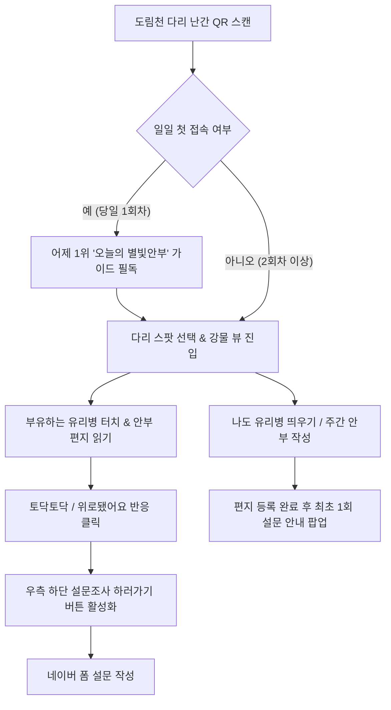

# [기획서] 별빛내린천 디지털 타임캡슐 & 유리병 편지 서비스

---

## 1. 문서 개요 (Document Overview)

| 항목 | 내용 |
| :--- | :--- |
| **프로젝트명** | 별빛내린천(도림천) 디지털 타임캡슐 & 유리병 편지 웹 서비스 |
| **작성일자** | 2026년 9월 17일 |
| **문서 버전** | v2.0 (오늘의 별빛안부 & 주제별 별빛안부 시스템 적용) |
| **서비스 영역** | 위치 기반(QR) 웹 애플리케이션 (PWA / Mobile Web) |
| **타겟 연령/지역** | 관악구 도림천 산책로 이용 시민 및 청년·1인 가구 |
| **설문조사 연동 URL** | [https://naver.me/xfboPA29](https://naver.me/xfboPA29) |

---

## 2. 기획 배경 및 핵심 의도 (Background & Intent)

### 2.1 기획 의도 및 취지
1. **서로의 안부를 묻고 따뜻한 위로를 전하는 온기 공간**
   - 본 서비스는 단순한 익명 게시판이 아니라, **"산책하는 이웃에게 서로의 안부를 묻고 그에 대한 깊은 위로를 받는 것"**을 핵심 기획 목적으로 설정했습니다.
2. **"위로됐어요(✨)" 반응 기반 1위 산출 시스템**
   - 가장 많은 사람들이 읽고 실질적인 마음의 위안을 얻은 글(가장 높은 **'위로됐어요'** 반응수)을 **"오늘의 별빛안부"**로 선정하여 전체 이용자에게 대표 튜토리얼 가이드로 선사합니다.
3. **주간 안부 주제 시스템 (Weekly Topic System)**
   - 매주 새로운 안부 주제(예: *"오늘 하루, 스스로에게 건네고 싶은 안부는 무엇인가요?"*)를 운영하여 **[오늘의 별빛안부]**와 **[주제별 별빛안부]** 두 축으로 커뮤니티 활성화를 유도합니다.

---

## 3. 서비스 정의 및 핵심 가치 (Service Definition & Core Values)

```
[별빛내린천 디지털 타임캡슐]
"도림천을 걷는 너에게, 어제의 내가 띄우는 한 줄 안부와 위로"
```

1. **안부와 위로 (Greetings & Comfort)**: 하루의 고단함을 서로 안부로 묻고 '토닥토닥'과 '위로됐어요'로 화답합니다.
2. **주간 주제 연계 (Weekly Topic Engagement)**: 주마다 새로워지는 안부 질문으로 유저의 지속적인 재방문 유도.
3. **위치 기반 공감 (Location Context)**: 도림천 주요 다리(신림교, 봉림교 등)의 고유 안부 퀘스트 제공.

---

## 4. 타겟 사용자 및 유저 시나리오 (User Journey Map)



---

## 5. 상세 시스템 기능 명세 (System Functional Specifications)

### 5.1 오늘의 별빛안부 (KST 00:00 갱신 가이드)
- **"위로됐어요" (`reacts.cheer`) 1위 집계**: 전날 24시간 동안 가장 많은 **'위로됐어요'** 반응을 받아 시민들에게 깊은 울림을 준 안부 글을 추출.
- **게임 튜토리얼 팝업**: 일일 첫 접속자 한정 필독 후 강물 뷰 진입 (당일 2회차 접속부터 자동 생략).
- **실시간 00:00 갱신 카운트다운 타이머**: 다음 별빛안부 갱신까지 남은 시간을 시:분:초로 실시간 표시.

### 5.2 주제별 별빛안부 (Weekly Topic System)
- **주간 안부 질문 배너**: 가이드 모달 및 편지 서랍장에 이번 주 안부 주제(예: *"오늘 하루, 스스로에게 건네고 싶은 안부는 무엇인가요?"*) 노출.
- **주제별 서랍장 필터**: 편지 서랍장 상단 탭에서 **[오늘의 별빛안부]**와 **[주제별 별빛안부]**만 따로 모아볼 수 있는 필터링 기능 제공.

### 5.3 반응 연동형 설문조사 시스템 (Naver Form Integration)
- **편지 작성 후 최초 1회 팝업**: 편지 작성 완료 시 1회 한정으로 네이버 폼(`https://naver.me/xfboPA29`) 참여 의사 확인.
- **반응 연동 동적 버튼**:
  - **반응 전**: 모달 하단에 `[← 강물로 돌아가기]` 버튼만 **중앙 정렬**되어 배치.
  - **반응(토닥토닥/위로됐어요) 클릭 후**: 반응 시 `[← 강물로 돌아가기]`(좌) & **`[📋 설문조사 하러가기]`**(우)로 전환.

---

## 6. UI/UX 디자인 가이드 및 비주얼 시스템 (Design System)

| 디자인 요소 | 명세 및 가이드 |
| :--- | :--- |
| **메인 배경** | `public/image_e57129.jpg` (도림천 야경 & 별빛내린천 비주얼 아트) |
| **컬러 팔레트** | Deep Slate (`#030712`), Neon Cyan (`#06b6d4`), Amber Gold (`#f59e0b`), Rose Warm (`#f43f5e`) |
| **핵심 인터랙션** | 토닥토닥(❤️), 위로됐어요(✨), 가라앉히기(⚓) |
| **타이포그래피** | Pretendard / System Sans-serif |

---

## 7. 기술 아키텍처 (Technical Architecture)

- **Core Framework**: React 18 + Vite (Tailwind CSS v4)
- **State Persistence**: `localStorage` (KST 00:00 기준 당일 접속 및 설문 참여 상태 제어)
- **Timezone Handler**: KST (UTC+9) Date Utility

---
*본 기획서는 작성 완료된 서비스 취지 및 코드베이스 기능 명세를 바탕으로 업데이트되었습니다.*
