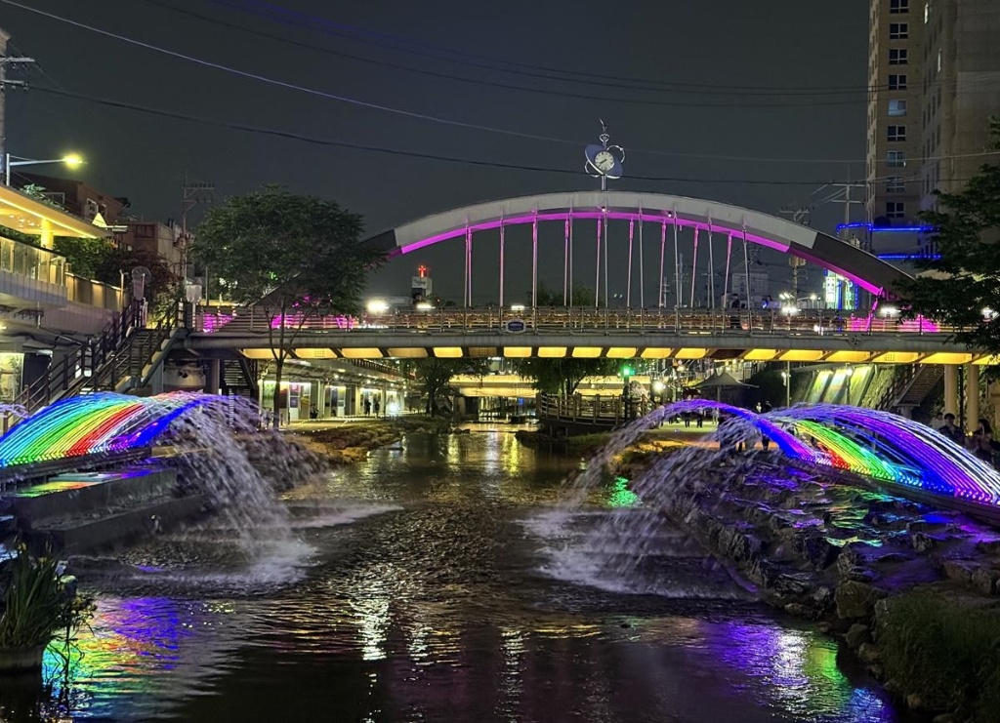
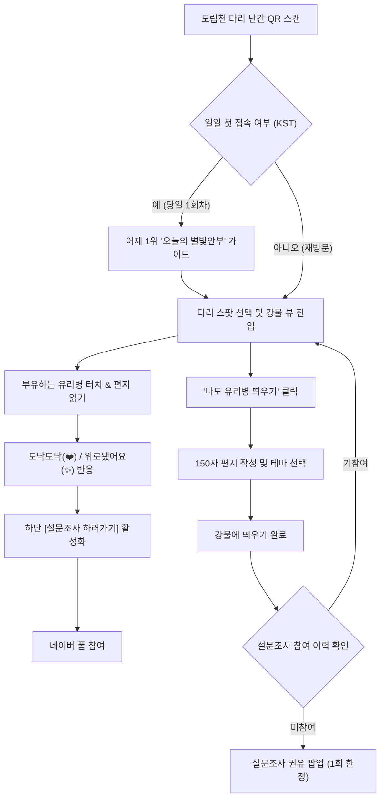

# 🌌 별빛내린천 디지털 타임캡슐 & 유리병 편지
> **"도림천을 걷는 너에게, 어제의 내가 띄우는 한 줄 안부와 위로"**  
> 관악구 도림천(별빛내린천) 산책로 이용 시민 및 청년·1인 가구를 위한 **위치 기반 익명 롤링페이퍼 웹 서비스**

<br />

<p align="center">
  
</p>

<p align="center">
  
  
  
  
  
</p>

---

## 📌 목차 (Table of Contents)
1. [프로젝트 소개](#1-프로젝트-소개-project-overview)
2. [기획 배경 및 가치](#2-기획-배경-및-핵심-가치-background--core-values)
3. [핵심 기능 명세](#3-핵심-기능-명세-key-features)
4. [사용자 흐름도 (User Journey)](#4-사용자-흐름도-user-journey)
5. [UI/UX 디자인 시스템](#5-uiux-디자인-시스템-design-system)
6. [기술 스택 및 아키텍처](#6-기술-스택-및-아키텍처-tech-stack--architecture)
7. [폴더 및 파일 구조](#7-폴더-및-파일-구조-project-structure)
8. [시작 가이드 (Getting Started)](#8-시작-가이드-getting-started)
9. [향후 확장 계획 (Roadmap)](#9-향후-확장-계획-roadmap)

---

## 1. 프로젝트 소개 (Project Overview)

**별빛내린천 디지털 타임캡슐 & 유리병 편지**는 관악구 도림천(별빛내린천)을 산책하는 시민, 고시촌 청년, 1인 가구들이 앱 설치나 회원가입 없이 **다리 난간에 부착된 QR 코드 스캔만으로 즉시 마음을 나눌 수 있는 위치 기반 웹 애플리케이션**입니다.

- **서비스 형태**: 위치 기반(QR) 반응형 모바일 웹 (App-like UX)
- **타겟 유저**: 관악구 도림천 산책로 이용 시민, 1인 가구, 고시촌 청년 및 직장인
- **설문조사 연동**: [네이버 폼 피드백 설문](https://naver.me/xfboPA29)

---

## 2. 기획 배경 및 핵심 가치 (Background & Core Values)

### 🌿 "피로감 없는 느슨한 정서적 연대"
현대 도시민과 1인 가구는 일상의 고단함 속에서 타인과의 깊은 관계 맺기에 피로를 느끼면서도, 따뜻한 위로와 공감에는 목말라 있습니다.

1. **온기 가득한 안부 교환**
   - 단순 휘발성 게시판을 지양하고, **"산책하는 이웃에게 서로의 안부를 묻고 그에 대한 깊은 위로를 건네받는 공간"**을 지향합니다.
2. **"위로됐어요(✨)" 반응 기반 일간 1위 시스템**
   - 이용자들이 읽고 실질적인 마음의 위안을 얻은 편지를 KST 자정(00:00) 기준으로 자동 집계하여, 전체 접속자에게 따뜻한 튜토리얼 가이드로 선사합니다.
3. **주간 안부 질문 (Weekly Topic)**
   - 매주 새로운 질문을 던져 산책자의 사색과 지속적인 재방문을 유도합니다.

---

## 3. 핵심 기능 명세 (Key Features)

### 🌉 1. 다리 거점별 가상 위치 체크인
- **4대 주요 스팟 지원**: 신림교, 봉림교, 동방1교, 서원보도교
- 각 다리의 고유한 지리적·감성적 특성에 맞춘 질문 테마 제공
- QR 스캔 시 1.4초간의 부드러운 위치 확인 인디케이터 제공

### 🌟 2. 오늘의 별빛안부 (KST 00:00 갱신 일일 가이드)
- 전날 24시간 동안 **'위로됐어요(✨)'** 반응을 가장 많이 받은 대표 온기 편지 선정
- **하루 1회 팝업 가이드**: 당일 첫 접속 시 자동 노출 (`localStorage` 기반, 자정 기준 갱신)
- **자정 갱신 타이머**: 다음 1위 별빛안부 갱신까지 남은 시간을 시:분:초로 실시간 카운트다운

### 🌊 3. 실시간 부유 유리병 & 인터랙티브 강물 뷰
- 실제 도림천 야경 위로 자연스럽게 둥둥 떠다니는 4~5개의 감성 유리병 애니메이션
- **물결 젓기 (셔플)**: 도림천 물결을 저어 새로운 유리병들을 수면 위로 즉시 리로드
- **유리병 열기**: 터치 시 Glassmorphism 모달을 통해 편지 본문 및 작성 위치/시간 확인

### ✍️ 4. 나도 유리병 띄우기 (편지 작성)
- **4가지 감성 테마**: 노을빛(Amber), 달빛(Cyan), 위로빛(Rose), 물결빛(Emerald)
- **안전한 작성 환경**: 150자 제한 실시간 카운터 및 비속어/혐오 표현 정규식 필터링
- **감성 애니메이션**: 전송 완료 시 편지가 물결을 타고 멀어지는 `float-away` 트랜지션 적용

### ❤️ 5. 정서적 리액션 & 설문 연동
- **리액션 3종**:
  - `❤️ 토닥토닥`: 지친 마음에 건네는 가벼운 위로
  - `✨ 위로됐어요`: 마음 깊은 울림을 준 글에 보내는 감사
  - `⚓ 가라앉히기`: 부적절한 글에 대한 자정 작용 (신고)
- **반응 연동형 동적 네이버 폼 버튼**:
  - 반응 전: 모달 하단 `[← 강물로 돌아가기]` 중앙 정렬
  - 반응 후: `[← 강물로 돌아가기]` & `[📋 설문조사 하러가기]`로 자연스럽게 전환
- **최초 작성자 설문 유도**: 편지 등록 완료 시 단 1회 팝업으로 사용자 경험 피드백 수집

### 🗄️ 6. 도림천 편지 서랍장 (바텀시트 필터링)
- 수면 아래 흐르는 모든 유리병 편지를 바텀시트로 확인
- **4종 정밀 필터**:
  - `전체`: 최신순 정렬
  - `오늘의 별빛안부`: 위로됐어요 순 랭킹
  - `주제별 별빛안부`: 이번 주 안부 주제 참여 편지만 선별
  - `내 접속 다리`: 현재 머무는 다리의 편지만 필터링

---

## 4. 사용자 흐름도 (User Journey)



---

## 5. UI/UX 디자인 시스템 (Design System)

| 구분 | 사양 및 디자인 가이드 |
| :--- | :--- |
| **화면 레이아웃** | `max-w-md mx-auto h-[100dvh]` 모바일 뷰포트 고정 (앱 감성 극대화) |
| **배경 비주얼** | 별빛내린천 야경 아트워크 + 어두운 수면 오버레이 + 반짝이는 별빛 파티클 |
| **컬러 시스템** | Deep Slate (`#030712`), Neon Cyan (`#06b6d4`), Amber Gold (`#f59e0b`), Rose Warm (`#f43f5e`) |
| **머티리얼** | **Glassmorphism** (`backdrop-blur-md`, 반투명 화이트 보더, 은은한 네온 글로우) |
| **타이포그래피** | Pretendard / System Sans-serif, 모바일 최적 가독성 행간 및 자간 |
| **애니메이션** | 커스텀 Keyframes (`floatSlow`, `floatGentle`, `waterRipple`, `floatAway`) |

---

## 6. 기술 스택 및 아키텍처 (Tech Stack & Architecture)

### Frontend
- **Core**: React 19 (`19.2.8`), Vite 8 (`8.3.0`)
- **Styling**: Tailwind CSS v4 (`4.3.3`), PostCSS 8
- **Icons**: Lucide React (`1.46.0`)
- **Linting**: ESLint 10

### State & Storage Architecture
- **Context API + Custom Hook**: `LetterContext` & `useLetter`를 통한 단계(Step) 제어, 메시지 상태 전파, 필터 및 모달 통합 관리
- **Local Persistence**: `localStorage`를 활용하여 KST(한국 표준시) 기준 일일 1위 가이드 열람 여부 및 설문조사 응답 상태 유지
- **Timezone Utility**: KST(UTC+9) 기준 당일/어제 날짜 계산 및 자정 카운트다운 타이머 연산

---

## 7. 폴더 및 파일 구조 (Project Structure)

```
dorimcheon-letter/
├── public/
│   ├── dorimcheon.svg                 # 도림천 벡터 그래픽
│   ├── dorimcheon_night_illust.jpg    # 도림천 야경 일러스트 에셋
│   ├── image_e57129.jpg               # 서비스 메인 수면 야경 배경화면
│   └── favicon.svg                    # 브라우저 파비콘
├── src/
│   ├── assets/                        # 이미지 및 정적 리소스
│   ├── components/
│   │   ├── common/
│   │   │   ├── Header.jsx             # 상단 헤더 & 다리 인디케이터 & 가이드 버튼
│   │   │   ├── LoadingSpinner.jsx     # 위치 확인/로딩 스피너
│   │   │   └── Toast.jsx              # 액션 피드백 전역 토스트 알림
│   │   └── features/
│   │       ├── BottleItem.jsx         # 수면 위 부유 유리병 개별 컴포넌트
│   │       ├── LetterListDrawer.jsx   # 바텀시트 전체 편지 서랍장 (필터링 지원)
│   │       ├── ReactionButtons.jsx    # 토닥토닥/위로됐어요/가라앉히기 버튼군
│   │       └── RiverBackground.jsx    # 도림천 배경 및 반짝임/물결 레이어
│   ├── context/
│   │   ├── LetterContext.jsx          # 편지, 위치, 모달, 리액션 전역 상태 제공자
│   │   └── createLetterContext.js     # Context 객체 정의
│   ├── data/
│   │   ├── locations.js               # 4대 다리 정보 및 고유 질문 데이터
│   │   └── mockMessages.js            # 초기 온기 편지 및 주간 주제 데이터
│   ├── hooks/
│   │   └── useLetter.js               # LetterContext 소비용 커스텀 훅
│   ├── pages/
│   │   ├── DailyTopGuideModal.jsx     # 어제 1위 오늘의 별빛안부 일일 가이드 모달
│   │   ├── IntroLocationCheck.jsx     # 첫 접속 위치(다리) 선택 및 QR 인증 화면
│   │   ├── ReadLetterModal.jsx        # 유리병 편지 읽기 & 설문 버튼 전환 모달
│   │   ├── RiverView.jsx              # 유리병이 흐르는 메인 강물 뷰
│   │   ├── SurveyPromptModal.jsx      # 편지 등록 후 1회 한정 설문 안내 팝업
│   │   └── WriteLetterModal.jsx       # 유리병 편지 작성 및 테마 선택 모달
│   ├── utils/
│   │   ├── dateUtils.js               # KST 시간대 계산 및 자정 카운트다운 유틸
│   │   ├── filter.js                  # 금칙어/비속어 정규식 유효성 검사기
│   │   └── surveyUtils.js             # 네이버 폼 연동 및 참여 상태 제어 유틸
│   ├── App.jsx                        # 최상위 뷰 라우팅 및 뷰포트 레이아웃 셸
│   ├── index.css                      # Tailwind v4 및 커스텀 물결 애니메이션 설정
│   └── main.jsx                       # 엔트리 포인트
├── PROJECT_PROPOSAL.md                # 상세 기획서 v2.0
├── package.json                       # 패키지 의존성 및 스크립트 설정
├── tailwind.config.js
└── vite.config.js
```

---

## 8. 시작 가이드 (Getting Started)

### 요구사항 (Prerequisites)
- [Node.js](https://nodejs.org/) v18.0.0 이상 권장
- npm v9.0.0 이상

### 설치 및 로컬 실행 (Installation & Run)

```bash
# 1. 레포지토리 클론
git clone https://github.com/Starlight-Greetings/frontend.git
cd frontend

# 2. 패키지 의존성 설치
npm install

# 3. 로컬 개발 서버 구동 (Vite)
npm run dev
```

브라우저에서 `http://localhost:5173`으로 접속하여 확인합니다. (모바일 뷰 모드 권장: `F12` -> 디바이스 툴바)

### 빌드 및 배포 미리보기 (Build & Preview)

```bash
# 프로덕션 빌드
npm run build

# 빌드 결과물 로컬 미리보기
npm run preview
```

---

## 9. 향후 확장 계획 (Roadmap)

- [ ] **Web Geolocation API 고도화**: 도림천 산책로 진입 시 GPS 좌표 기반으로 가장 가까운 다리 자동 인식
- [ ] **BaaS / 서버 연동**: Supabase 또는 Firebase Firestore 연동을 통한 실시간 편지 동기화 및 영구 저장
- [ ] **Web Push / PWA 오프라인 지원**: 매일 밤 별빛안부 갱신 알림 및 서비스 워커 캐싱
- [ ] **관악구청 및 자치단체 연계**: 도림천 실제 다리 난간에 방수 안심 QR 플레이트 시범 설치
- [ ] **감성 사운드스케이프**: 은은한 도림천 물소리와 백색소음 토글 기능 제공

---

## 👥 기여 및 피드백 (Feedback)
- **서비스 설문조사 링크**: [https://naver.me/xfboPA29](https://naver.me/xfboPA29)
- 소중한 의견은 도림천 산책로의 따뜻한 오프라인 공간 개선과 서비스 기능 고도화에 적극 반영됩니다.

---
<p align="center">© 2026 별빛내린천 디지털 타임캡슐 팀. All rights reserved.</p>
